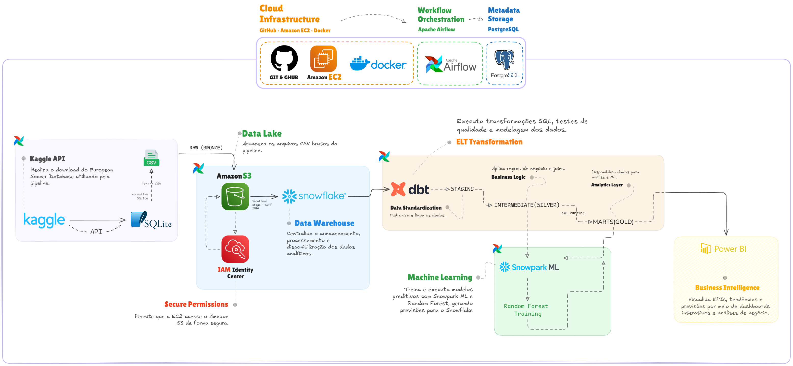
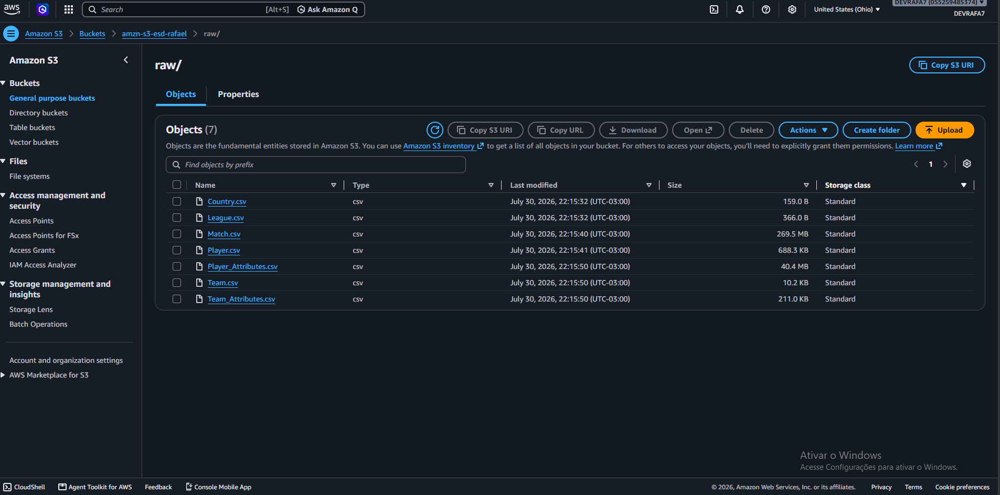
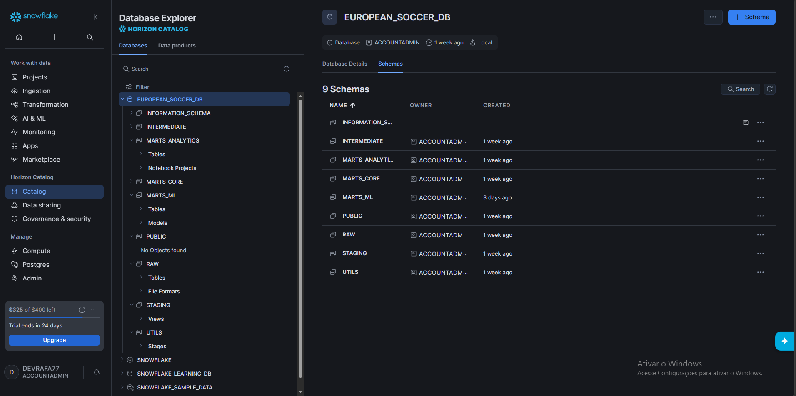
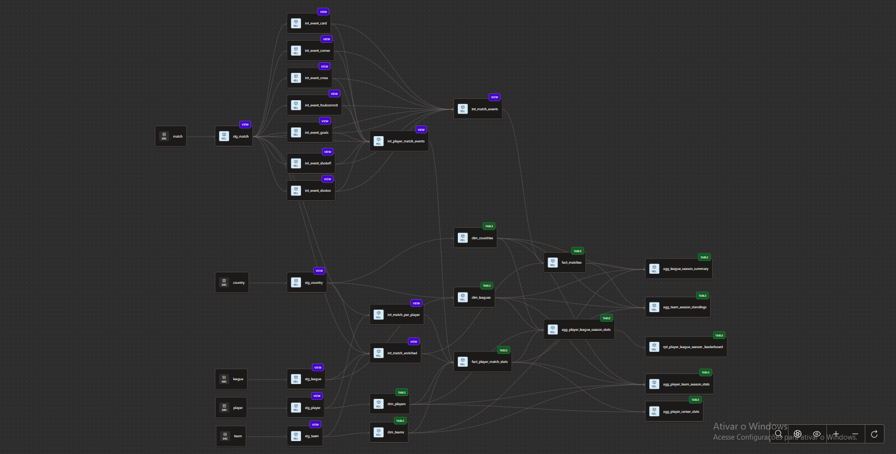
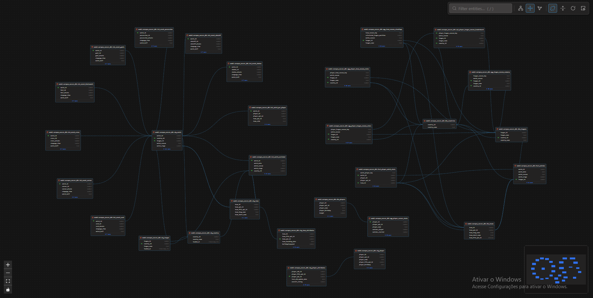
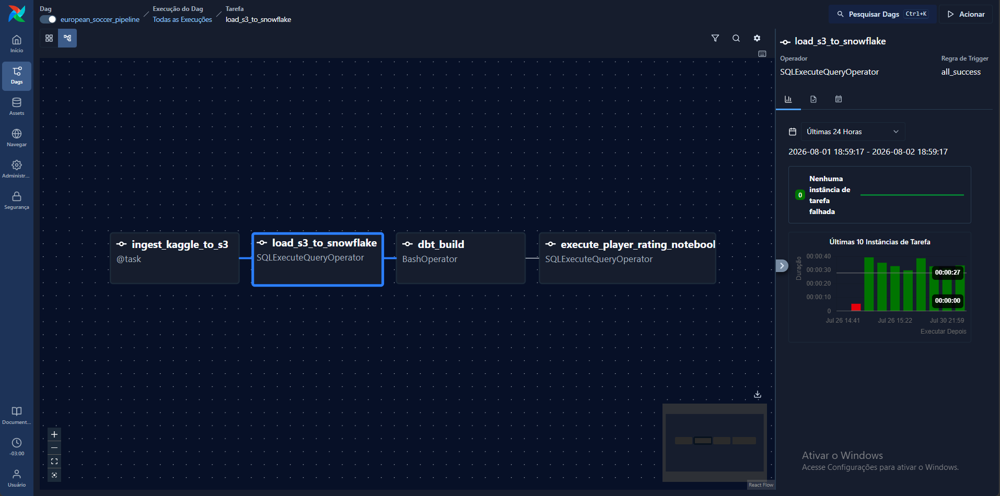
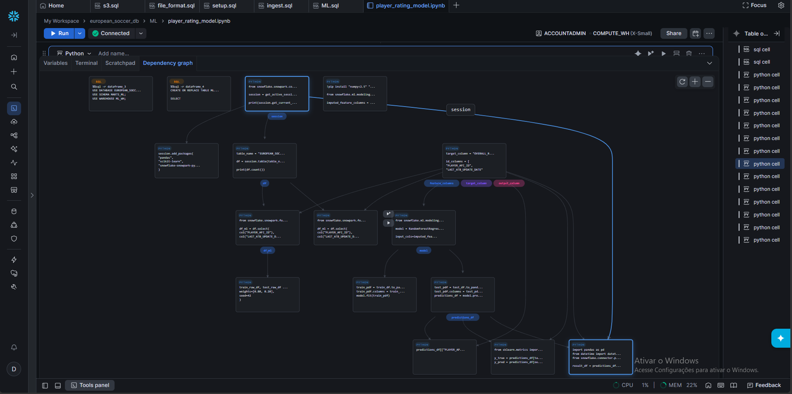
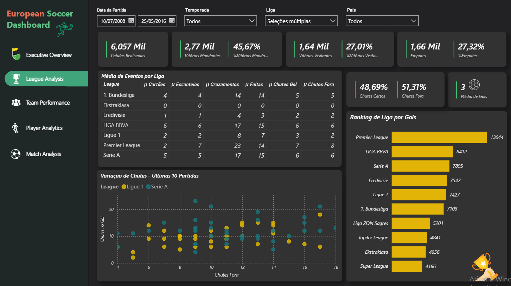
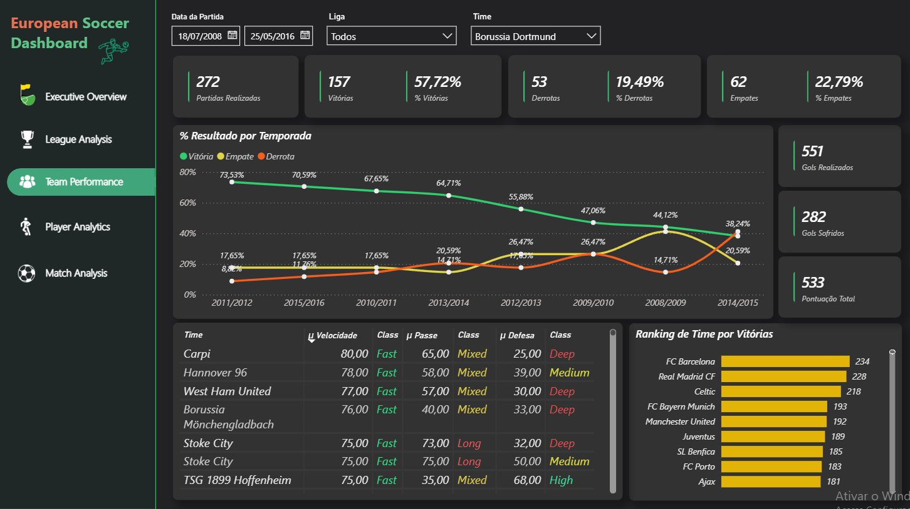

European Soccer Data Platform

End-to-End Data Engineering, Analytics Engineering, Machine Learning & Business Intelligence

  A cloud-based data platform that ingests the European Soccer Database from Kaggle,
  converts SQLite data into CSV files, stores them in an Amazon S3 data lake,
  loads and transforms them in Snowflake with dbt, orchestrates the complete workflow
  with Apache Airflow, trains a Random Forest regression model with Snowpark ML,
  and delivers interactive analytics through Power BI.

  
  
  
  
  
  
  

Table of Contents

Project Overview

Architecture

Technology Stack

End-to-End Data Flow

Data Warehouse Architecture

dbt Transformation Layer

Workflow Orchestration

Machine Learning

Power BI Analytics

Data Quality

Project Structure

How to Run the Project

Deployment on AWS EC2

Validation and Troubleshooting

Security Practices

Project Highlights

Limitations and Future Improvements

Author

Project Overview

The European Soccer Data Platform is an end-to-end portfolio project covering the complete data lifecycle:

Kaggle API
    ↓
SQLite Database
    ↓
Python Conversion to CSV
    ↓
Amazon S3 Data Lake
    ↓
Snowflake External Stage + COPY INTO
    ↓
Snowflake RAW Layer
    ↓
dbt Staging and Intermediate Models
    ↓
dbt Core and Analytics Marts
    ↓
Snowpark ML Random Forest Training
    ↓
Prediction and Model Evaluation Tables
    ↓
Power BI Dashboards

The platform combines four major disciplines:

Data Engineering: ingestion, cloud storage, warehouse loading and orchestration.

Analytics Engineering: data modeling, transformation, documentation and testing with dbt.

Machine Learning: player rating prediction using Snowpark ML and Random Forest regression.

Business Intelligence: interactive analysis of leagues, matches, teams, players and model predictions.

The entire workflow is version-controlled with Git and GitHub, containerized with Docker, orchestrated by Apache Airflow, and deployed on AWS EC2.

Architecture

  

Architecture summary

Stage

Technology

Responsibility

Source

Kaggle API

Downloads the European Soccer Database

Source format

SQLite

Original relational database format

Extraction

Python

Reads SQLite tables and exports CSV files

Access control

AWS IAM

Authorizes secure access to S3 and AWS resources

Data lake

Amazon S3

Stores raw CSV files under the raw/ prefix

Warehouse

Snowflake

Stores and processes raw, transformed and analytical data

Loading

Snowflake Stage + COPY INTO

Loads CSV files from S3 into RAW tables

Transformation

dbt

Builds staging, intermediate, core and analytical models

Data quality

dbt tests

Validates keys, relationships, business rules and model integrity

Orchestration

Apache Airflow

Executes ingestion, loading, transformation and ML tasks

Infrastructure

Docker + AWS EC2

Runs the Airflow platform and project services

Machine learning

Snowpark ML

Trains and evaluates a Random Forest regression model

Analytics

Power BI

Delivers dashboards, KPIs and predictive analysis

IAM is an access and security layer, not a data processing stage. It enables the ingestion process and Snowflake storage integration to access Amazon S3 securely.

Technology Stack

Data Engineering

Python

Pandas

SQLite

Kaggle API

Amazon S3

AWS IAM

AWS EC2

Snowflake

Snowflake External Stage

Snowflake Storage Integration

Snowflake COPY INTO

Analytics Engineering

dbt

Jinja

SQL

dbt tests

dbt packages

dbt documentation artifacts

dbt ERD and model lineage

Orchestration and Infrastructure

Apache Airflow

CeleryExecutor

Docker

Docker Compose

PostgreSQL

Redis

Git

GitHub

Machine Learning

Snowpark Python

Snowpark ML

Random Forest Regressor

Feature importance analysis

MAE, RMSE and R² evaluation

Business Intelligence

Power BI Desktop

Power Query

DAX

Snowflake connector

Interactive filtering and drill-down analysis

End-to-End Data Flow

1. Kaggle ingestion

The pipeline downloads the European Soccer Database from Kaggle through the Kaggle API.

The original dataset is stored as a SQLite database containing seven main source tables:

Country
League
Match
Player
Player_Attributes
Team
Team_Attributes

2. SQLite-to-CSV conversion

The ingestion script reads the SQLite database with Python and exports each source table as a separate CSV file.

Country.csv
League.csv
Match.csv
Player.csv
Player_Attributes.csv
Team.csv
Team_Attributes.csv

This step makes the source data compatible with the S3 and Snowflake ingestion workflow.

3. Amazon S3 data lake

The generated files are uploaded to an Amazon S3 bucket under the raw/ prefix.

  

s3://<bucket-name>/
└── raw/
    ├── Country.csv
    ├── League.csv
    ├── Match.csv
    ├── Player.csv
    ├── Player_Attributes.csv
    ├── Team.csv
    └── Team_Attributes.csv

4. Snowflake loading

Snowflake accesses S3 through a secure storage integration backed by AWS IAM.

The loading process uses:

UTILS.S3_STAGE

RAW.CSV_FILE_FORMAT

COPY INTO

Case-insensitive column matching

Automatic date and timestamp parsing

Controlled null handling

ON_ERROR = ABORT_STATEMENT

The ingestion task truncates and reloads the RAW tables to keep the pipeline reproducible for the static Kaggle source.

Data Warehouse Architecture

The Snowflake database is organized into clear responsibility-based schemas.

Database

EUROPEAN_SOCCER_DB

Schemas

Schema

Medallion layer

Purpose

RAW

Bronze

Stores source-aligned data loaded from Amazon S3

STAGING

Silver

Cleans, renames, casts and standardizes source columns

INTERMEDIATE

Silver

Applies joins, business rules, XML parsing and reusable transformations

MARTS_CORE

Gold

Stores facts and dimensions for analytical consumption

MARTS_ANALYTICS

Gold

Stores aggregated and dashboard-oriented models

MARTS_ML

Gold / ML

Stores training datasets, predictions, metrics and feature importance

UTILS

Utility

Stores stages, integrations, file formats and support objects

  

Medallion mapping

Bronze
└── RAW

Silver
├── STAGING
└── INTERMEDIATE

Gold
├── MARTS_CORE
├── MARTS_ANALYTICS
└── MARTS_ML

dbt Transformation Layer

dbt is responsible for transforming the Snowflake RAW layer into tested and documented analytical models.

Staging models

The staging layer creates one standardized model for each source table:

stg_country
stg_league
stg_match
stg_player
stg_player_attributes
stg_team
stg_team_attributes

Main responsibilities:

Rename generic IDs to business-oriented names

Cast columns to the correct data types

Trim and normalize text

Convert empty strings to null values

Standardize codes

Add ingestion metadata

Preserve one-to-one alignment with the source

Intermediate models

The intermediate layer contains reusable business transformations.

Representative models include:

int_match_enriched
int_match_per_player
int_player_match_events
int_event_card
int_event_corner
int_event_cross
int_event_foulcommit
int_event_goals
int_event_possession
int_event_shoton
int_event_shotoff

Match enrichment

int_match_enriched joins matches with teams, leagues and countries and creates derived fields such as:

Total goals

Match winner

Match result

Home and away team names

League and country context

Player UNPIVOT

The original match table stores players in 22 separate columns:

home_player_1 ... home_player_11
away_player_1 ... away_player_11

int_match_per_player converts these columns into row-level records, creating one row per player per match.

This structure makes player-level aggregation and event analysis possible.

XML event parsing

Several event columns in the original dataset are stored as XML.

The project converts these semi-structured values into relational models with Snowflake functions such as:

PARSE_XML(...)
LATERAL FLATTEN(...)
XMLGET(...)
GET(...)
TRY_TO_NUMBER(...)

Parsed events include:

Goals

Cards

Corners

Crosses

Fouls

Possession

Shots on target

Shots off target

The transformation also handles invalid player references such as "Unknown player" safely with TRY_TO_NUMBER.

Core marts

The core marts implement a dimensional model.

Representative fact tables:

fact_matches
fact_player_match_stats

Representative dimensions:

dim_country
dim_league
dim_team
dim_player
dim_players_attributes

Examples of metrics stored in the facts:

Match score

Total goals

Winner

Match result

Cards

Corners

Crosses

Fouls

Shots on target

Shots off target

Player goals

Assists

Cards

Fouls

Match-level player statistics

Analytics marts

The analytics layer contains pre-aggregated models designed for reporting and exploratory analysis.

Examples include:

Goals by season

League performance

Team performance

Player rating trends

Match event summaries

Dashboard-ready KPIs

dbt lineage

  

The complete view demonstrates the scale and dependency structure of the project. Additional zoomed images can document the Silver and Gold layers separately.

dbt data catalog

  

The catalog documents:

Model descriptions

Column descriptions

Data types

Data quality tests

Model dependencies

Source definitions

Workflow Orchestration

Apache Airflow orchestrates the entire pipeline.

DAG

european_soccer_pipeline

Main execution flow

ingest_kaggle_to_s3
        ↓
load_s3_to_snowflake
        ↓
run_dbt
        ↓
train_random_forest

Task responsibilities

Task

Responsibility

Output

ingest_kaggle_to_s3

Downloads the Kaggle dataset, converts SQLite tables to CSV and uploads them to S3

Raw CSV files in Amazon S3

load_s3_to_snowflake

Executes TRUNCATE and COPY INTO for all source tables

Refreshed Snowflake RAW tables

run_dbt

Runs dbt build with the project and profile directories

Tested Silver and Gold models

train_random_forest

Builds the ML dataset, trains the Snowpark ML model and stores predictions

ML tables in MARTS_ML

  

Airflow runtime

The Docker Compose environment includes:

Airflow API server / web interface

Scheduler

DAG processor

Celery worker

Triggerer

PostgreSQL metadata database

Redis message broker

Airflow uses the CeleryExecutor, allowing tasks to be distributed through workers.

The project can be executed manually or scheduled for recurring daily runs.

Machine Learning

The project extends the data platform with a supervised machine learning workflow inside Snowflake.

Prediction objective

Predict a player's future or held-out OVERALL_RATING using historical player attributes.

Model

Random Forest Regressor

A regression model is used because OVERALL_RATING is a numeric target.

ML workflow

Gold player attributes
        ↓
Feature selection and preparation
        ↓
Training and test split
        ↓
Random Forest training with Snowpark ML
        ↓
Prediction generation
        ↓
Metric calculation
        ↓
Predictions, metrics and feature importance stored in Snowflake

ML schema

MARTS_ML

Representative tables:

ML_PLAYER_RATING_DATASET
FACT_PLAYER_RATING_PREDICTIONS
ML_PLAYER_RATING_METRICS
ML_PLAYER_RATING_FEATURE_IMPORTANCE

Prediction output

PLAYER_API_ID
LAST_ATB_UPDATE_DATE
OVERALL_RATING
PREDICTED_OVERALL_RATING
ABSOLUTE_ERROR
PREDICTED_AT

Evaluation metrics

Mean Absolute Error — MAE

Root Mean Squared Error — RMSE

Coefficient of Determination — R²

Maximum absolute error

Prediction error distribution

Feature importance

Random Forest feature importance is persisted for analytical use, allowing Power BI to show which player attributes contributed most to the model.

  

Power BI Analytics

Power BI connects to Snowflake and consumes the Gold and ML layers.

  

  

Main analytical areas

Executive and league overview

Match analysis

Team tactical analysis

Player performance

Player attributes

Team playing style

Home win, away win and draw analysis

Goals, shots, cards, corners, crosses and fouls

Player rating prediction

Real versus predicted ratings

Prediction error analysis

Model performance

Feature importance

Example dashboard pages

Executive Overview
League Analysis
Match Analysis
Team Tactical Analysis
Player Performance
Machine Learning Predictions
Model Performance

Power BI features

Snowflake native connector

Power Query transformations

DAX measures

Dynamic filters

Drill-down analysis

Conditional formatting

KPI cards

Rankings

Scatter plots

Time-series analysis

Model evaluation visuals

Data Quality

Data quality is enforced during dbt build.

Primary key validation

- unique
- not_null

Applied to identifiers such as country, league, match, player, team and player attribute IDs.

Referential integrity

Relationship tests validate references between:

League and country

Match and country

Team attributes and team

Player match statistics and match facts

Facts and dimensions

Business rule validation

Examples:

Player attribute dates must be valid

Match and player records must respect the expected grain

Numeric metrics must remain in acceptable ranges

XML event player IDs are converted safely

Duplicate player positions per match are prevented with a combination test

Composite uniqueness

dbt_utils.unique_combination_of_columns is used where a single column is not enough to define the row grain.

Example:

match_id + player_position

Build behavior

dbt build performs dependency-aware model creation and testing. Failed quality tests prevent dependent models from being treated as successfully validated.

Project Structure

european-soccer-pipeline/
│
├── airflow/
│   ├── dags/
│   │   └── european_soccer_pipeline.py
│   ├── config/
│   ├── logs/
│   └── plugins/
│
├── dbt/
│   └── europan_soccer_dbt/
│       ├── analyses/
│       ├── macros/
│       ├── models/
│       │   ├── staging/
│       │   ├── intermediate/
│       │   └── marts/
│       │       ├── core/
│       │       └── analytics/
│       ├── seeds/
│       ├── snapshots/
│       ├── tests/
│       ├── dbt_project.yml
│       └── packages.yml
│
├── scripts/
│   └── ingest.py
│
├── images/
│   ├── solution-architecture.png
│   ├── amazon-s3-data-lake.png
│   ├── snowflake-data-warehouse.png
│   ├── dbt-data-lineage.png
│   ├── dbt-data-catalog.png
│   ├── airflow-dag.png
│   ├── machine-learning-pipeline.png
│   ├── model-performance.png
│   └── power-bi-dashboard.png
│
├── docker-compose.yaml
├── requirements.txt
├── .env.example
├── .gitignore
└── README.md

The exact file layout may vary slightly depending on whether the Snowpark ML training code is stored as a Python script, an Airflow task or an exported Snowflake Notebook.

How to Run the Project

Prerequisites

Install or configure:

Git

Docker

Docker Compose v2

AWS account

Amazon S3 bucket

IAM role or local AWS credentials

Snowflake account

Kaggle account and API token

Power BI Desktop for dashboard development

At least 4 GB of available memory for the Airflow container stack

1. Clone the repository

git clone https://github.com/devrafael7/european-soccer-pipeline.git
cd european-soccer-pipeline

2. Configure environment variables

cp .env.example .env

Example:

AIRFLOW_UID=50000

AWS_REGION=us-east-1
S3_BUCKET_NAME=<your-s3-bucket>
S3_RAW_PREFIX=raw

SNOWFLAKE_ACCOUNT=<your-account-identifier>
SNOWFLAKE_USER=<your-user>
SNOWFLAKE_PASSWORD=<your-password>
SNOWFLAKE_ROLE=<your-role>
SNOWFLAKE_WAREHOUSE=<your-warehouse>
SNOWFLAKE_DATABASE=EUROPEAN_SOCCER_DB
SNOWFLAKE_SCHEMA=RAW

Do not commit the .env file.

3. Configure Kaggle credentials

Linux/macOS:

mkdir -p ~/.kaggle
cp kaggle.json ~/.kaggle/kaggle.json
chmod 600 ~/.kaggle/kaggle.json

Windows:

C:\Users\<your-user>\.kaggle\kaggle.json

4. Configure AWS authentication

Recommended on EC2

Attach an IAM role to the EC2 instance with least-privilege access to the project bucket.

The ingestion process requires permissions such as:

s3:ListBucket
s3:GetObject
s3:PutObject

Local development

Use an AWS profile or the standard AWS credential chain.

aws configure
aws sts get-caller-identity

Avoid storing permanent AWS keys inside the repository.

5. Create the Snowflake database and schemas

Run the project setup SQL or execute the base structure:

CREATE DATABASE IF NOT EXISTS EUROPEAN_SOCCER_DB;

CREATE SCHEMA IF NOT EXISTS EUROPEAN_SOCCER_DB.RAW;
CREATE SCHEMA IF NOT EXISTS EUROPEAN_SOCCER_DB.STAGING;
CREATE SCHEMA IF NOT EXISTS EUROPEAN_SOCCER_DB.INTERMEDIATE;
CREATE SCHEMA IF NOT EXISTS EUROPEAN_SOCCER_DB.MARTS_CORE;
CREATE SCHEMA IF NOT EXISTS EUROPEAN_SOCCER_DB.MARTS_ANALYTICS;
CREATE SCHEMA IF NOT EXISTS EUROPEAN_SOCCER_DB.MARTS_ML;
CREATE SCHEMA IF NOT EXISTS EUROPEAN_SOCCER_DB.UTILS;

Then configure:

Warehouse

Role and grants

RAW tables

CSV file format

Storage integration

External stage

Utility procedures

The storage integration must reference the IAM role authorized to read the S3 bucket.

6. Configure the dbt profile

Create:

~/.dbt/profiles.yml

Example:

europan_soccer_dbt:
  target: dev
  outputs:
    dev:
      type: snowflake
      account: "{{ env_var('SNOWFLAKE_ACCOUNT') }}"
      user: "{{ env_var('SNOWFLAKE_USER') }}"
      password: "{{ env_var('SNOWFLAKE_PASSWORD') }}"
      role: "{{ env_var('SNOWFLAKE_ROLE') }}"
      database: EUROPEAN_SOCCER_DB
      warehouse: "{{ env_var('SNOWFLAKE_WAREHOUSE') }}"
      schema: RAW
      threads: 4
      client_session_keep_alive: false

Validate the connection:

cd dbt/europan_soccer_dbt
dbt debug
dbt deps
cd ../..

7. Initialize Airflow

docker compose config
docker compose up airflow-init

8. Start the platform

docker compose up -d
docker compose ps

Open Airflow locally:

http://localhost:8080

9. Configure Airflow connections

In the Airflow UI, configure:

AWS connection using the default AWS credential chain or EC2 instance role

Snowflake connection with account, user, warehouse, role, database and RAW as the default schema

10. Trigger the DAG

From the Airflow UI:

DAGs
→ european_soccer_pipeline
→ Trigger DAG

Or from a running Airflow container:

docker compose exec airflow-scheduler \
  airflow dags trigger european_soccer_pipeline

11. Follow task execution

ingest_kaggle_to_s3
        ↓
load_s3_to_snowflake
        ↓
run_dbt
        ↓
train_random_forest

All tasks should finish successfully before refreshing Power BI.

12. Run dbt manually

From the host:

cd dbt/europan_soccer_dbt
dbt debug
dbt deps
dbt build

From the Airflow worker container:

docker compose exec airflow-worker bash -lc \
  "cd /opt/airflow/dbt/europan_soccer_dbt && \
   dbt build --profiles-dir /home/airflow/.dbt"

13. Generate dbt artifacts

For dbt Fusion:

dbt compile --write-catalog

Expected artifacts:

target/manifest.json
target/catalog.json
target/run_results.json

For dbt Core environments that support the classic documentation server:

dbt docs generate
dbt docs serve

14. Connect Power BI

Open Power BI Desktop.

Select Get Data.

Choose Snowflake.

Enter the Snowflake account server.

Select EUROPEAN_SOCCER_DB.

Load models from MARTS_CORE, MARTS_ANALYTICS and MARTS_ML.

Validate relationships and refresh the report.

Deployment on AWS EC2

The Dockerized Airflow environment can run on an EC2 instance.

Deployment steps

git clone https://github.com/<your-github-username>/european-soccer-pipeline.git
cd european-soccer-pipeline

cp .env.example .env
# Edit the environment variables

docker compose up airflow-init
docker compose up -d
docker compose ps

IAM role

Attach an IAM role to the EC2 instance instead of storing AWS access keys on the server.

Security group

Port

Purpose

Source

22

SSH

Your public IP only

8080

Airflow UI

Your public IP only

80 / 443

Reverse proxy, when configured

Required trusted sources

Avoid exposing Airflow directly to 0.0.0.0/0.

Airflow access

http://<ec2-public-ip>:8080

For a production-style deployment, place Airflow behind HTTPS, authentication and a reverse proxy.

Validation and Troubleshooting

Confirm S3 files

aws s3 ls s3://<bucket-name>/raw/

Expected files:

Country.csv
League.csv
Match.csv
Player.csv
Player_Attributes.csv
Team.csv
Team_Attributes.csv

Confirm Airflow services

docker compose ps

Inspect Airflow logs

docker compose logs --tail=200 airflow-scheduler
docker compose logs --tail=200 airflow-worker

Validate dbt

cd dbt/europan_soccer_dbt
dbt debug
dbt build

Validate Snowflake RAW tables

SELECT COUNT(*) FROM EUROPEAN_SOCCER_DB.RAW.COUNTRY;
SELECT COUNT(*) FROM EUROPEAN_SOCCER_DB.RAW.LEAGUE;
SELECT COUNT(*) FROM EUROPEAN_SOCCER_DB.RAW.MATCH;
SELECT COUNT(*) FROM EUROPEAN_SOCCER_DB.RAW.PLAYER;
SELECT COUNT(*) FROM EUROPEAN_SOCCER_DB.RAW.PLAYER_ATTRIBUTES;
SELECT COUNT(*) FROM EUROPEAN_SOCCER_DB.RAW.TEAM;
SELECT COUNT(*) FROM EUROPEAN_SOCCER_DB.RAW.TEAM_ATTRIBUTES;

Validate the Gold layer

SELECT COUNT(*) FROM EUROPEAN_SOCCER_DB.MARTS_CORE.FACT_MATCHES;
SELECT COUNT(*) FROM EUROPEAN_SOCCER_DB.MARTS_CORE.FACT_PLAYER_MATCH_STATS;

Validate ML outputs

SELECT *
FROM EUROPEAN_SOCCER_DB.MARTS_ML.ML_PLAYER_RATING_METRICS;

SELECT *
FROM EUROPEAN_SOCCER_DB.MARTS_ML.FACT_PLAYER_RATING_PREDICTIONS
LIMIT 100;

SELECT *
FROM EUROPEAN_SOCCER_DB.MARTS_ML.ML_PLAYER_RATING_FEATURE_IMPORTANCE
ORDER BY FEATURE_IMPORTANCE DESC;

Stop the environment

docker compose down

To also remove local volumes:

docker compose down -v

Use the second command carefully because it removes local Airflow metadata volumes.

Security Practices

AWS access is controlled with IAM.

EC2 uses an attached IAM role whenever possible.

Snowflake accesses S3 through a storage integration.

Secrets are excluded from Git.

.env, profiles.yml, kaggle.json and credential files must never be committed.

Security group access is restricted to trusted IP addresses.

Snowflake roles and grants should follow least privilege.

Public bucket access remains disabled.

The RAW layer is isolated from analytical consumption.

Credentials should be rotated when exposed or shared accidentally.

Recommended .gitignore entries:

.env
*.env
.kaggle/
kaggle.json
profiles.yml
logs/
target/
dbt_packages/
__pycache__/
*.pyc
.DS_Store

Project Highlights

End-to-end cloud data platform from source ingestion to BI.

Real AWS S3 data lake implementation.

Secure S3 access through IAM and Snowflake storage integration.

Snowflake layered warehouse with Bronze, Silver and Gold architecture.

dbt staging, intermediate, core and analytics models.

Star-schema modeling with facts and dimensions.

Complex XML event parsing in Snowflake.

UNPIVOT of 22 player columns into player-match records.

Automated dbt data quality tests.

Airflow orchestration running in Docker with CeleryExecutor.

Cloud deployment on AWS EC2.

Snowpark ML Random Forest regression.

Predictions, evaluation metrics and feature importance persisted in Snowflake.

Interactive Power BI dashboards connected to the Gold and ML layers.

Git and GitHub version control.

Visual architecture, lineage, catalog and execution documentation.

Limitations and Future Improvements

Current limitations

The Kaggle dataset is historical and static.

The reload strategy is optimized for reproducibility rather than incremental source ingestion.

Model quality depends on the historical player attributes available in the dataset.

Power BI refresh depends on Snowflake connectivity and configured credentials.

Possible improvements

Add incremental dbt models for large fact tables.

Add dbt snapshots for slowly changing player and team attributes.

Add CI checks for SQL formatting, dbt compilation and tests.

Add Terraform for AWS infrastructure provisioning.

Add automated deployment through GitHub Actions.

Add model versioning and experiment tracking.

Add drift monitoring for the player rating model.

Add alerting for Airflow task failures.

Add a reverse proxy and HTTPS for the Airflow UI.

Add cost monitoring for Snowflake warehouses and AWS resources.

Author

Rafael Oliveira

Data Engineering · Analytics Engineering · Machine Learning · Business Intelligence

This project was created as a complete portfolio implementation demonstrating how cloud infrastructure, data orchestration, analytical modeling, machine learning and business intelligence can operate as one integrated platform.

European Soccer Data Platform

Kaggle → SQLite → CSV → AWS S3 → Snowflake → dbt → Snowpark ML → Power BI

